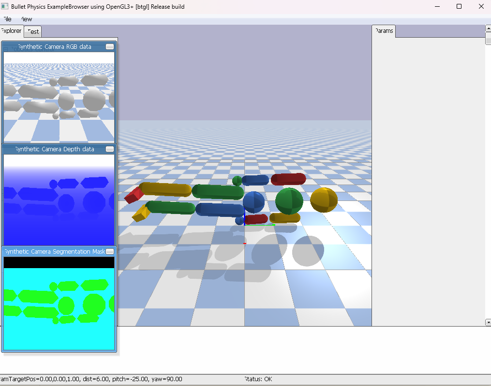
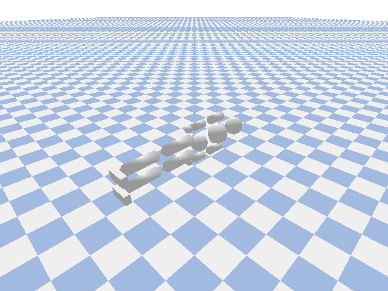
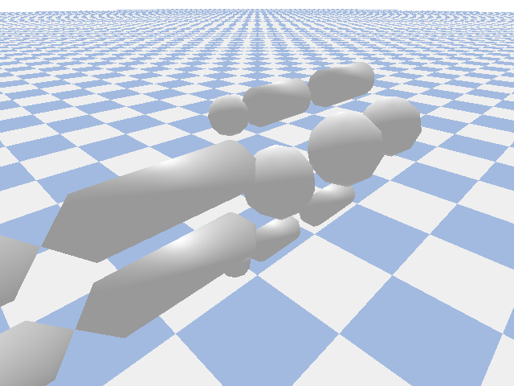

# RL_control_project

The main file structure:

```plaintext
RL_control_project/
├── CMakeLists.txt
├── README.md
├── logs/
│   └── log.csv
└── src/
    ├── main.cpp
    ├── robot/
    │   ├── humanoid.cpp
    │   └── humanoid.h
    ├── control/
    │   ├── pid.cpp
    │   └── pid.h
    ├── RL/
    │   ├── policy.cpp
    │   └── policy.h
    ├── system/
    │   ├── latency.cpp
    │   ├── latency.h
    │   └── logger.h

```


This project explores reinforcement learning as an adaptive control layer
for embodied robotic systems under real-world deployment constraints.


## Motivation
Modern RL policies often fail when deployed on physical robots due to:
- Latency and dropped control frames
- Sensor noise and partial observability
- Energy constraints and instability
- Interaction with low-level controllers


This project investigates how learning-based policies can be integrated
safely and effectively into real-time robotic control loops.


## Architecture
High-level policy (continuous-action RL)
- Latency & drop modeling
- Safety-constrained torque commands
- Multi-joint humanoid dynamics

The system is implemented entirely in C++ with no ML frameworks, enabling
deterministic timing and low-level experimentation.

## Features
- Gaussian policy gradient (from scratch)
- Latency buffers and dropped frames
- Humanoid joint abstraction
- Noise injection for sim-to-real realism
- Energy-aware reward shaping
- Experiment logging and metrics

## Research Focus
This code is designed to:
- Expose failure modes of RL in real-time systems
- Quantify stability and adaptation under delays
- Serve as a testbed for sim-to-real strategies
- Bridge classical control and modern learning

## Future Work
- Hardware-in-the-loop deployment
- Vision-language-action integration
- Adaptive gain scheduling
- Safety-certified control layers


## How to run

- Install linux on windows (WSL + ubuntu).
```Bash
sudo apt update
sudo apt install build-essential
```
- Verify that GCC is visible:
```Bash
g++ --version
```

-  Create a build directory inside the project folder and then build the project.
```Bash
cd build
cmake ..
```

- Make it executable
```Bash
make -j
./RL_control_project
```

## Visualize log file
### 2D
I visualized robot motion in 2D by computing (x, y) positions from joint angles(q0...q5) and plotting them with matplotlib, creating an animated linkage of the robot’s joints. 


### 3D
For 3D, we map each joint angle to its corresponding PyBullet joint 
```python
(JOINT_MAP = {
    "q0":  # right_hip
    "q1":  # right_knee
    "q2":  # right_ankle
    "q3":  # left_hip
    "q4":  # left_knee
    "q5":  # left_ankle
})
```


using setJointMotorControl2, then step the simulation and render the robot from a camera view to see its full 3D motion.




### Vision Language Action (VLA)

We want to upgrade your existing C++ RL humanoid project into a Vision-Language-Action (VLA) system, meaning the robot can use camera input + textual instructions to decide its actions. Here’s a VLA model on top of the existing structure.

We will extend the project so that the RL policy now receives:

Visual input: images from the humanoid’s camera.

Language input: commands or goals in text form.

Outputs actions: motor/joint commands for the robot.


With adding this we will have file structure as follows:


```plaintext
src/
├── main.cpp           <- now initializes VLA agent and loops
├── robot/             <- humanoid kinematics remain
├── control/           <- PID controllers still work for low-level execution
├── RL/
│   ├── policy.h       <- upgrade to VLA_Policy.h to accept vision+language
│   └── policy.cpp
├── system/
│   ├── latency.h
│   ├── latency.cpp
│   └── logger.hAccepts images + instructions.

‍‍
```

Encodes image via a CNN or pretrained visual backbone.

Encodes text via a language model embedding.

Fuses both embeddings into a policy network that outputs joint actions.

### Simulation
At each simulation step:

Capture camera frame from humanoid (humanoid.get_camera_image()).

Read the instruction string.

Pass both to VLA_Policy::select_action(image, instruction).

Apply output to joints via existing PID controllers.

Log everything to CSV for visualization.

The log file (vla_log.csv) is a record of the humanoid robot’s joint positions over time, generated by the C++ VLA (Vision-Language-Action) simulation. Each row corresponds to a timestep, and each column (q0–q5) stores the angle of a specific joint, effectively capturing the robot’s motion trajectory. In the PyBullet Python [script](./Logs/replay_VLA_RL_control.py), we take this log file and replay the recorded joint positions in a 3D simulation, applying each set of joint angles to the humanoid model step by step . While replaying, we optionally capture frames from the virtual camera, which can then be combined into a GIF, allowing us to visually inspect the robot’s movement and evaluate how the learned VLA policy translates to motion in a physics-based environment.






